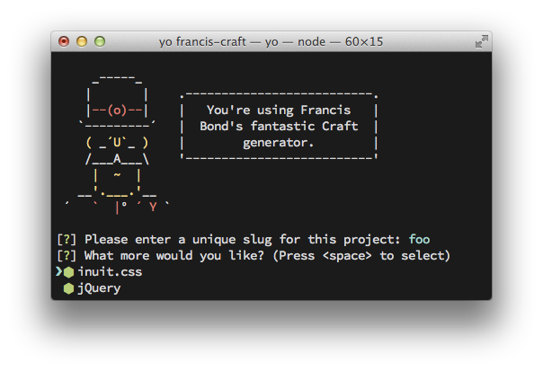

generator-francis-craft
=======================

[Francis Bond's](http://francisbond.com) [Yeoman](http://yeoman.io) generator for scaffolding a [Craft](http://buildwithcraft.com) website with [Gulp](http://gulpjs.com/), Bower, Sass, inuit.css, Modernizr, and jQuery.

## Features

* Set up a fresh copy of Craft
* Generate a Vagrantfile with provisioning via Puppet
* Deploy to a Dokku-powered server
* Copy databases between local and remote environments
* Automatically compile Sass with Autoprefixing
* Automatically lint your Javascript
* Image optimization (png, jpg, gif)
* Optionally include inuit.css and jQuery

## Initialization

* Install: `npm install -g francisbond/generator-francis-craft`
* Run: `yo francis-craft`
* Run `gulp build` for building and `gulp watch` for preview
* Use `gulp deploy-init` to initalise a deployment environment
* Run `gulp deploy` after committing changes to deploy them
* Use `gulp db-push` and `gulp db-pull` to push and pull databases between local and remote environments

### Requirements
* For using the provided development environment, VirtualBox, Vagrant, and the [Vagrant Host Manager](https://github.com/smdahlen/vagrant-hostmanager) plugin must be installed.
* The generator requires Ruby and Sass to be installed, and inuit.css requires at least Sass 3.3. Using the newest version available is recommended: `gem install sass`.
* Yeoman, Bower, and gulp.js should be installed globally via npm.

## Available Commands

### Deployment

* `gulp deploy-init`

  Initialize a Dokku container for use in the project's deployment.

  1. Adds a git remote corresponding with the Dokku server.
  2. Pushes the repository to the Dokku remote.
  3. Defines a Buildpack for Dokku to use in the project's deployment.
  4. Sets up and links a new MariaDB container.

  You should follow this command with gulp db-push.

* `gulp deploy`

  Pushes the repository to the Dokku remote.

* `gulp db-push`

  Dumps the local database to `/.tmp`, and imports it to the linked Dokku MariaDB container.

* `gulp db-pull`

  Dumps the remote Dokku MariaDB database to `/.tmp`, and imports it to the local environment.

* `gulp db-dump`

  Dumps the local and remote databases, and saves them to `/databases`.

### Development

* `gulp watch`

  Watches the project for changes in images, styles, javascript, HTML, etc. and performs appropriate actions. Skips some non-critical resource-intensive processes (e.g. image optimization).

* `gulp build`

  Build the project for deployment. Performs all tasks including minification and image optimization.

### Miscellaneous

* `bower install`

  Install project-specific Bower packages defined in bower.json. You should run this command when cloning an already initialized repository.

* `npm install`

  Install project-specific npm packages defined in the package.json. You should run this command when cloning an already initialized repository.

## Known Issues

* Upon initial deployment to the Dokku server, the website will sometimes return a 502 or 504 error. This is usually fixed by making a commit and running `gulp deploy`.
* Rerunning `gulp deploy-init` will fail, since a Dokku remote has already been created. Running `git remote remove dokku` will resolve this.
* `gulp deploy` will sometimes fail if a newer commit has been deployed but not pushed to the repository. You can override this by running `git push origin dokku --force`.
